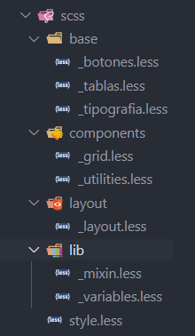
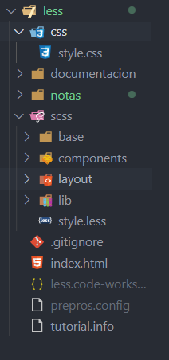

# 1. Importar archivos

> library.less Para archivos less, se compilara en el archivo final donde se lo importe.

```less
@import "library.less";
```

> Para que **_no se compile_** un archivo importado, poner guion bajo( \_ ) en el inico del nombre del archivo.

```less
@import "./ruta/_library.less";
//Este archivo no se compilara.
```

> importar archivos css.

```less
@import "typo.css";
// este archivo se compila en el archivo final less.
```

### 1.2 Opciones de importación

```less
@import (opcion1, opcion2) "filename.less";
```

> Pueden ir sin refencias (_Sin parentesis_) o usarse hasta dos opciones, depende de la opcion para que se compile o no en el archivo.

```less
@import (reference) "archivo.less";
// use un archivo Less pero no lo compila no lo incluye en el archivo less y css.

@import (inline) "archivo.less";
//incluya el archivo fuente en la salida css, pero no lo compila

@import (less) "archivo.less";
//trata el archivo como un archivo Less, sin importar la extensión del archivo

@import (css) "archivo.less";
//trata el archivo como un archivo css, sin importar la extensión del archivo

@import (once) "archivo.less";
//solo incluye el archivo una vez (este es el predeterminado)

@import (multiple) "archivo.less";
//incluye el archivo varias veces

@import (optional) "archivo.less";
//continuar compilando cuando no se encuentra el archivo
```

# 2. Variables

> una variables es un contenedor de un valor para reutilizarlo.
> Los colores deben ir en variables

```less
@var1: 10px;
@var2: @var1 + 10px;

//Usar asi:
#header {
  width: @var1;
  height: @var2;
}

// Compilara el css asi:
#header {
  width: 10px;
  height: 20px;
}
```

### 2.1 Constantes

> Se declaran igual que las variables pero se las usa para: **padding, margins, separaciones**

### 2.2 Anidaciones

> Referenciar al padre del elemento sin escribir otro elemento.  
> Para que no ponga espacios en las pseuduclases poner &

```less
#header {
  color: black;
  .navigation {
    font-size: 12px;
  }
  .logo {
    width: 300px;
  }
}
```

> Imprime

```css
#header {
  color: black;
}
#header .navigation {
  font-size: 12px;
}
#header .logo {
  width: 300px;
}
```

> Para que no ponga espacios en las pseuduclases poner &

```less
ul {
  propiedad: valor1;
  propiedad: valor2;
  li {
    propiedad: valor1;
    propiedad: valor2;
    //Para que no ponga espacios en las pseuduclases poner &
    &:hover {
      propiedad: valor1;
      propiedad: valor2;
      //Pone hover en el elemento li
    }
  }
}

//imprime
ul {
  propiedad: valor1;
  propiedad: valor2;
}
ul li {
  propiedad: valor1;
  propiedad: valor2;
}
ul li:hover {
  // si no pongo el & dejaria un espacio entre li y :
  propiedad: valor1;
  propiedad: valor2;
}
```

> O tambien.

```less
.btn {
  propiedad: valor1;
  &:hover {
    // no es necesario poner (btn:hover)
    propiedad: valor1;
  }
  &--alert {
    // no es necesario poner (btn--hover)
    propiedad: valor1;
  }
}
//imprime
.btn {
  propiedad: valor1;
}
.btn:hover {
  propiedad: valor1;
}
.btn--alert {
  propiedad: valor1;
}
```

# 3. Mixins

> Los mixin no van a crear ningun elemento extra hasta que lo utilicemos.

> Es una forma de incluir ("mezclar") un montón de propiedades de un conjunto de reglas en otro conjunto de reglas

```less
.bordes-1() {
  border: solid 5px #fef;
  padding: 115px 0;
}
```

> Usar

```less
p{
  .bordes-1();
  // Agarra todas las propiedaddes del mixin
```

> Sale o imprime

```css
p {
  border: solid 5px #fef;
  padding: 115px 0;
}
```

### 3.1 Mixins parametricos

> Para usarlos con variables y no estar cambiando valores manualmente.

```less
//Valor de la @variable que tengo que pasar un valor al usar el mixin
.max-width(@variable: 1024px) {
  propiedad: valor1;
  propiedad: @variable;
  // @variable tiene 1024px
}
body {
  .max-width(80%);
  //Calculara el 80% del  valor(1024px) que usa la @variable
  // si no se pone parametro usa el valor por defecto.
}
//Compila
body {
  propiedad: valor1;
  propiedad: 819, 2px;
  //819,2 es el 80% de 1024
}
```

# 4. Parciales o creación de archivos

> ### Archivos y carpetas para un proyecto less
>
> > 

> ### Imagen de los archivos y sus directorios
>
> > 

### 4.1 Estructura del archivo _style.less_

```less
@import "./lib/_variables.less";
@import "./lib/mixins.less";

@import "./base/_tipografia.less";
@import "./base/_botones.less";
@import "./base/_tablas.less";
@import "./components/_grid.less";

@import "./layout/_layout.less";

@import "./components/_utilities.less";
//Este archivo va a tener clases de uso masivo
```
